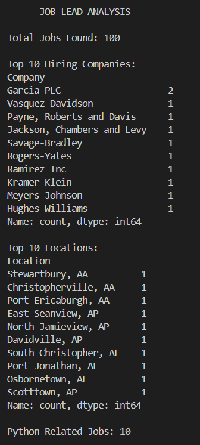
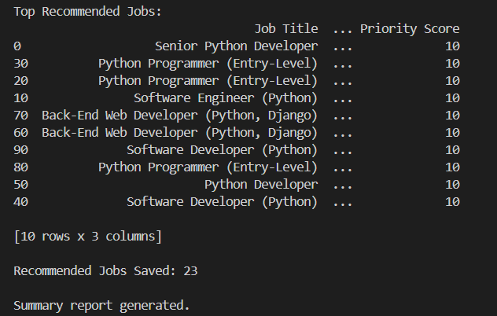
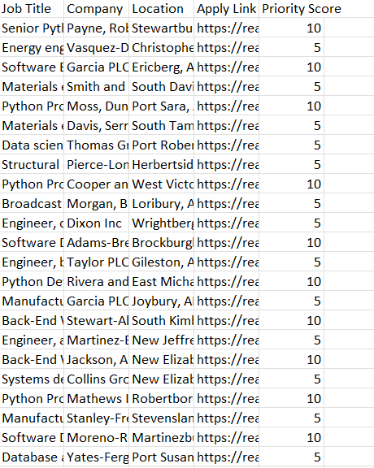

# AI-Powered Internship Lead Generator

## Overview

This project is a Python-based lead generation and web scraping tool that automatically collects job opportunities, stores them in CSV format, performs data analysis, and recommends relevant positions based on skill keywords.

## Features

- Web scraping using BeautifulSoup
- Data collection and storage using Pandas
- CSV export of job leads
- Job recommendation system
- Summary report generation
- Hiring trend analysis

## Technologies Used

- Python
- Requests
- BeautifulSoup
- Pandas

## Project Structure

lead-generator/

├── scraper.py

├── analyzer.py

├── requirements.txt

├── README.md

├── output/

│ ├── leads.csv

│ ├── recommended_jobs.csv

│ └── summary_report.txt

└── screenshots/

## Workflow

1. Scrape job listings from a website.
2. Extract:
   - Job Title
   - Company
   - Location
   - Apply Link
3. Store extracted data in CSV format.
4. Analyze hiring trends.
5. Recommend relevant jobs using keyword-based scoring.
6. Generate a summary report.

## Output Files

### leads.csv

Contains all scraped job listings.

### recommended_jobs.csv

Contains filtered and recommended job opportunities.

### summary_report.txt

Contains project statistics and analysis results.

## Sample Analysis

- Total Jobs Scraped: 100
- Python Related Jobs: 10
- Recommended Jobs: 23

## Future Improvements

- Machine Learning based job recommendation
- Resume matching
- Email lead extraction
- Real-time job monitoring

## Screenshots

### Analysis Results - Part 1

### Analysis Results - Part 2

### Recommended Jobs CSV Output

